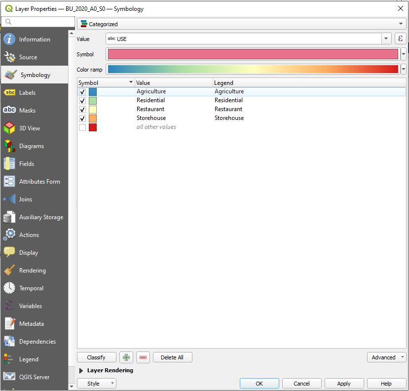
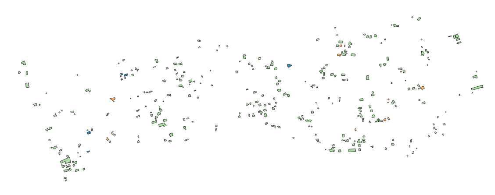
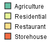

.. _categorized-style:

Categorized Style
=================

The categorized style is simillar to `QGIS <https://qgis.org/en/site/>`_ categorized style.

The categorized style is available for all point, line and polygon datasets. This class is inherited from simple style. Below is the example of generating the categorized style for polygon dataset,

.. code:: python

    # Import and initialized package
    from pysld.style import StyleSld
    sld = StyleSld(
                style_name='polygonStyle', 
                geom_type='polygon', 
                attribute_name='USE',
                values=['Agriculture', 'Residential', 'Restaurant', 'Storehouse'],
                color_palette='Spectral_r', 
            )
    
    # Generate the categorized style 
    style = sld.generate_categorized_style()
    print(style)

**Note:** If you want to add the label feature, simple add two more parameters, ``feature_label=True`` and ``attribute_name_label`` to the ``StyleSld`` class. 

The above code will generate the following map with corresponding legend,

Which is simillar to following ``xml``,

.. code:: xml

    <StyledLayerDescriptor version="1.0.0" xsi:schemaLocation="http://www.opengis.net/sld StyledLayerDescriptor.xsd" xmlns="http://www.opengis.net/sld" xmlns:ogc="http://www.opengis.net/ogc" xmlns:xlink="http://www.w3.org/1999/xlink" xmlns:xsi="http://www.w3.org/2001/XMLSchema-instance">
    <NamedLayer>
        <Name>polygonStyle</Name>
        <UserStyle>
        <Title>polygonStyle</Title>
        <FeatureTypeStyle>
            <Rule>
                <Name>Agriculture</Name>
                <Title>Agriculture</Title>
                <ogc:Filter>
                    <ogc:PropertyIsEqualTo>
                        <ogc:PropertyName>USE</ogc:PropertyName>
                        <ogc:Literal>Agriculture</ogc:Literal>
                    </ogc:PropertyIsEqualTo>
                </ogc:Filter>
            <PolygonSymbolizer>
                <Fill>
                    <CssParameter name="fill">#66c2a5</CssParameter>
                    <CssParameter name="fill-opacity">1</CssParameter>
                </Fill>
                <Stroke>
                    <CssParameter name="stroke">#333333</CssParameter>
                    <CssParameter name="stroke-width">1</CssParameter>
                </Stroke>
            </PolygonSymbolizer>
            </Rule>
            <Rule>
                <Name>Residential</Name>
                <Title>Residential</Title>
                <ogc:Filter>
                    <ogc:PropertyIsEqualTo>
                        <ogc:PropertyName>USE</ogc:PropertyName>
                        <ogc:Literal>Residential</ogc:Literal>
                    </ogc:PropertyIsEqualTo>
                </ogc:Filter>
                <PolygonSymbolizer>
                    <Fill>
                        <CssParameter name="fill">#e6f598</CssParameter>
                        <CssParameter name="fill-opacity">1</CssParameter>
                    </Fill>
                    <Stroke>
                        <CssParameter name="stroke">#333333</CssParameter>
                        <CssParameter name="stroke-width">1</CssParameter>
                    </Stroke>
                </PolygonSymbolizer>
            </Rule>
            <Rule>
                <Name>Restaurant</Name>
                <Title>Restaurant</Title>
                <ogc:Filter>
                    <ogc:PropertyIsEqualTo>
                        <ogc:PropertyName>USE</ogc:PropertyName>
                        <ogc:Literal>Restaurant</ogc:Literal>
                    </ogc:PropertyIsEqualTo>
                </ogc:Filter>
                <PolygonSymbolizer>
                    <Fill>
                        <CssParameter name="fill">#fee08b</CssParameter>
                        <CssParameter name="fill-opacity">1</CssParameter>
                    </Fill>
                    <Stroke>
                        <CssParameter name="stroke">#333333</CssParameter>
                        <CssParameter name="stroke-width">1</CssParameter>
                    </Stroke>
                </PolygonSymbolizer>
            </Rule>
            <Rule>
                <Name>Storehouse</Name>
                <Title>Storehouse</Title>
                <ogc:Filter>
                    <ogc:PropertyIsEqualTo>
                        <ogc:PropertyName>USE</ogc:PropertyName>
                        <ogc:Literal>Storehouse</ogc:Literal>
                    </ogc:PropertyIsEqualTo>
                </ogc:Filter>
                <PolygonSymbolizer>
                    <Fill>
                        <CssParameter name="fill">#f46d43</CssParameter>
                        <CssParameter name="fill-opacity">1</CssParameter>
                    </Fill>
                    <Stroke>
                        <CssParameter name="stroke">#333333</CssParameter>
                        <CssParameter name="stroke-width">1</CssParameter>
                    </Stroke>
                </PolygonSymbolizer>
            </Rule>
        </FeatureTypeStyle>
        </UserStyle>
    </NamedLayer>
    </StyledLayerDescriptor>

.. _style-for-postgis-data:

Generate style for PostGIS data 
^^^^^^^^^^^^^^^^^^^^^^^^^^^^^^^^

If the shapefile is available in ``PostgreSQL`` database, then you need to provide the PostgreSQL connection parameters as below,

.. code:: python

    # Import and initialized package
    from pysld.style import StyleSld
    sld = StyleSld(
                style_name='polygonStyle', 
                geom_type='polygon', 
                attribute_name='USE',
                color_palette='Spectral_r', 

                # Postgres connection parameters 
                dbname='postgres',
                user='postgres',
                password='admin',
                host='localhost',
                port='5432',
                schema='public',
                pg_table_name='postgres_table_name'
            )
    
    print(sld.values) # It will print the unique values from postgres_table_name table 

    style = sld.generate_categorized_style()  # Generate the categorized style 
    print(style) # print categorized style file

The above ``StyleSld`` will get the values internally and create the categorized style file for ``postgres_table_name`` table.

.. _categorized-style-options:

Available options for categorized style
^^^^^^^^^^^^^^^^^^^^^^^^^^^^^^^^^^^^^^^

.. list-table:: Options for ``StyleSld`` 
    :widths: 15 15 15 55
    :header-rows: 1

    * - Options
      - DataType
      - Default
      - Description 

    * - attribute_name
      - string
      - 
      - The attribute name for generating the categorized style. The attribute name either provided directly or can be get using ``get_attribute_name()`` function. See :ref:`additional-functions` for more detail.

    * - values 
      - string
      - 
      - The values based on which the categorized style will be generated. The values either provided directly or can be get using ``get_values_from_pg()`` function. See :ref:`additional-functions` for more detail.

    * - color_palette
      - string, list of colors, dict 
      - 'Spectral_r'
      - The color palette to represent the layer. Check all the available names of color palette `here <https://matplotlib.org/stable/tutorials/colors/colormaps.html>`_

    * - dbname 
      - string
      - None
      - PostgreSQL database name. This parameter will be used for the PostgreSQL connection.

    * - user
      - string
      - 'postgres'
      - PostgreSQL database user. This parameter will be used for the PostgreSQL connection.

    * - password
      - string
      - 'admin'
      - PostgreSQL database user password. This parameter will be used for the PostgreSQL connection.

    * - host
      - string
      - 'localhost'
      - PostgreSQL database host. This parameter will be used for the PostgreSQL connection.
  
    * - port 
      - integer
      - 5432
      - PostgreSQL database host. This parameter will be used for the PostgreSQL connection.

    * - schema 
      - string 
      - 'public'
      - PostgreSQL database data schema. This parameter will be used for get the data from PostgreSQL.

    * - pg_table_name
      - string 
      - None 
      - PostgreSQL database data table name. This parameter will be used for get the data from PostgreSQL table.

Since the ``categorized style`` is inherited from ``simple style``, it supports all the parameters from ``simple style`` as well, see :ref:`simple-style-options`.

