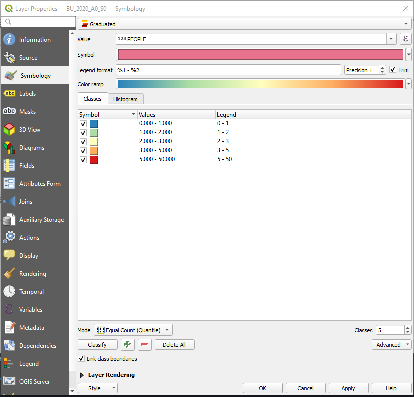

Classified Style
=================

The Classified style is simillar to `QGIS <https://qgis.org/en/site/>`_ graduated style.

The Classified style is available for all point, line and polygon datasets. This class is inherited from categorized style and simple style. Below is the example of generating the Classified style for polygon dataset,

.. code:: python

    # Import and initialized package
    from pysld.style import StyleSld
    sld = StyleSld(
                style_name='polygonStyle', 
                geom_type='polygon', 
                attribute_name='USE',
                values=[1,2,3,34,23,122,12,2,3,21,23,32,1,23,42,1,23,1,1,23,4,3,54,6,768,8,554,3,43,543,6,657,7,75,4,4],
                number_of_class=5,
                classification_method='natural_break',
                color_palette='Spectral_r', 
            )
    
    # Generate the Classified style 
    style = sld.generate_classified_style()
    print(style)

**Note:** If you want to add the label feature, simple add two more parameters, ``feature_label=True`` and ``attribute_name_label`` to the ``StyleSld`` class. 

The above code will return the following text,

.. code:: xml

    <StyledLayerDescriptor version="1.0.0" xsi:schemaLocation="http://www.opengis.net/sld StyledLayerDescriptor.xsd" xmlns="http://www.opengis.net/sld" xmlns:ogc="http://www.opengis.net/ogc" xmlns:xlink="http://www.w3.org/1999/xlink" xmlns:xsi="http://www.w3.org/2001/XMLSchema-instance">
        <NamedLayer>
            <Name>polygonStyle</Name>
            <UserStyle>
            <Title>polygonStyle</Title>
            <FeatureTypeStyle>
                <Rule>
                    <Name>&gt;= 1.0 and &lt; 43.0</Name>
                    <Title>&gt;= 1.0 and &lt; 43.0</Title>
                    <ogc:Filter>
                        <ogc:And>
                        <ogc:PropertyIsGreaterThanOrEqualTo>
                            <ogc:PropertyName>USE</ogc:PropertyName>
                            <ogc:Literal>1.0</ogc:Literal>
                        </ogc:PropertyIsGreaterThanOrEqualTo>
                        <ogc:PropertyIsLessThan>
                            <ogc:PropertyName>USE</ogc:PropertyName>
                            <ogc:Literal>43.0</ogc:Literal>
                        </ogc:PropertyIsLessThan>
                        </ogc:And>
                    </ogc:Filter>
                    <PolygonSymbolizer>
                        <Fill>
                            <CssParameter name="fill">S</CssParameter>
                            <CssParameter name="fill-opacity">1</CssParameter>
                        </Fill>
                        <Stroke>
                            <CssParameter name="stroke">#333333</CssParameter>
                            <CssParameter name="stroke-width">1</CssParameter>
                        </Stroke>
                    </PolygonSymbolizer>
                </Rule>
                <Rule>
                    <Name>&gt;= 43.0 and &lt; 122.0</Name>
                    <Title>&gt;= 43.0 and &lt; 122.0</Title>
                    <ogc:Filter>
                        <ogc:And>
                        <ogc:PropertyIsGreaterThanOrEqualTo>
                            <ogc:PropertyName>USE</ogc:PropertyName>
                            <ogc:Literal>43.0</ogc:Literal>
                        </ogc:PropertyIsGreaterThanOrEqualTo>
                        <ogc:PropertyIsLessThan>
                            <ogc:PropertyName>USE</ogc:PropertyName>
                            <ogc:Literal>122.0</ogc:Literal>
                        </ogc:PropertyIsLessThan>
                        </ogc:And>
                    </ogc:Filter>
                    <PolygonSymbolizer>
                        <Fill>
                            <CssParameter name="fill">p</CssParameter>
                            <CssParameter name="fill-opacity">1</CssParameter>
                        </Fill>
                        <Stroke>
                            <CssParameter name="stroke">#333333</CssParameter>
                            <CssParameter name="stroke-width">1</CssParameter>
                        </Stroke>
                    </PolygonSymbolizer>
                </Rule>
                <Rule>
                    <Name>&gt;= 122.0 and &lt; 554.0</Name>
                    <Title>&gt;= 122.0 and &lt; 554.0</Title>
                    <ogc:Filter>
                        <ogc:And>
                        <ogc:PropertyIsGreaterThanOrEqualTo>
                            <ogc:PropertyName>USE</ogc:PropertyName>
                            <ogc:Literal>122.0</ogc:Literal>
                        </ogc:PropertyIsGreaterThanOrEqualTo>
                        <ogc:PropertyIsLessThan>
                            <ogc:PropertyName>USE</ogc:PropertyName>
                            <ogc:Literal>554.0</ogc:Literal>
                        </ogc:PropertyIsLessThan>
                        </ogc:And>
                    </ogc:Filter>
                    <PolygonSymbolizer>
                        <Fill>
                            <CssParameter name="fill">e</CssParameter>
                            <CssParameter name="fill-opacity">1</CssParameter>
                        </Fill>
                        <Stroke>
                            <CssParameter name="stroke">#333333</CssParameter>
                            <CssParameter name="stroke-width">1</CssParameter>
                        </Stroke>
                    </PolygonSymbolizer>
                </Rule>
                <Rule>
                    <Name>&gt;= 554.0 and &lt; 657.0</Name>
                    <Title>&gt;= 554.0 and &lt; 657.0</Title>
                    <ogc:Filter>
                        <ogc:And>
                        <ogc:PropertyIsGreaterThanOrEqualTo>
                            <ogc:PropertyName>USE</ogc:PropertyName>
                            <ogc:Literal>554.0</ogc:Literal>
                        </ogc:PropertyIsGreaterThanOrEqualTo>
                        <ogc:PropertyIsLessThan>
                            <ogc:PropertyName>USE</ogc:PropertyName>
                            <ogc:Literal>657.0</ogc:Literal>
                        </ogc:PropertyIsLessThan>
                        </ogc:And>
                    </ogc:Filter>
                    <PolygonSymbolizer>
                        <Fill>
                            <CssParameter name="fill">c</CssParameter>
                            <CssParameter name="fill-opacity">1</CssParameter>
                        </Fill>
                        <Stroke>
                            <CssParameter name="stroke">#333333</CssParameter>
                            <CssParameter name="stroke-width">1</CssParameter>
                        </Stroke>
                    </PolygonSymbolizer>
                </Rule>
                <Rule>
                    <Name>&gt;= 657.0 and &lt; 768.0</Name>
                    <Title>&gt;= 657.0 and &lt; 768.0</Title>
                    <ogc:Filter>
                        <ogc:And>
                        <ogc:PropertyIsGreaterThanOrEqualTo>
                            <ogc:PropertyName>USE</ogc:PropertyName>
                            <ogc:Literal>657.0</ogc:Literal>
                        </ogc:PropertyIsGreaterThanOrEqualTo>
                        <ogc:PropertyIsLessThan>
                            <ogc:PropertyName>USE</ogc:PropertyName>
                            <ogc:Literal>768.0</ogc:Literal>
                        </ogc:PropertyIsLessThan>
                        </ogc:And>
                    </ogc:Filter>
                    <PolygonSymbolizer>
                        <Fill>
                            <CssParameter name="fill">t</CssParameter>
                            <CssParameter name="fill-opacity">1</CssParameter>
                        </Fill>
                        <Stroke>
                            <CssParameter name="stroke">#333333</CssParameter>
                            <CssParameter name="stroke-width">1</CssParameter>
                        </Stroke>
                    </PolygonSymbolizer>
                </Rule>
            </FeatureTypeStyle>
            </UserStyle>
        </NamedLayer>
    </StyledLayerDescriptor>

For PostGIS data, check :ref:`style-for-postgis-data` section from :ref:`categorized-style`.

For the feature label check :ref:`add-feature-label` section from :ref:`simple-style`.

Available options for classified style
^^^^^^^^^^^^^^^^^^^^^^^^^^^^^^^^^^^^^^

Since the ``classifed style`` is inherited from :ref:`categorized-style` and :ref:`simple-style`, it supports all the parameters and function from ``categorized style`` and ``simple style`` as well, see :ref:`categorized-style-options` and :ref:`simple-style-options`.

.. list-table:: Options for ``StyleSld`` 
    :widths: 15 15 15 55
    :header-rows: 1

    * - Options
      - DataType
      - Default
      - Description 

    * - number_of_class
      - integer
      - 5
      - The number of classes for classify the values.
  
    * - values
      - list of numeric values
      - 
      - It should be list of numeric values. See :ref:`additional-functions` for more detail.

    * - classification_method 
      - string
      - 'natural_break'
      - The classification method for classify the vlaues. Available options are, ``natural_break``, ``equal_interval``, ``quantile``, ``standard_deviation`` and ``geometrical_interval``.

