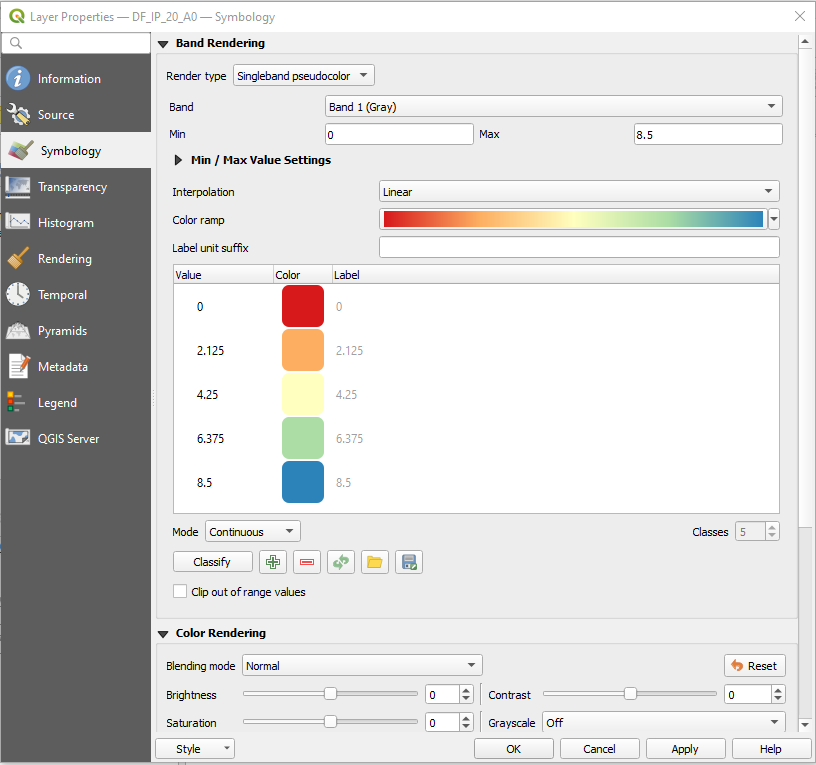

Raster Style
=================

The Raster style is simillar to `QGIS <https://qgis.org/en/site/>`_ singleband pseudocolor.

The below is the example code for raster style 

.. code:: python

    # Import and initialized package
    from pysld.style import StyleSld
    sld = StyleSld(
                style_name='polygonStyle', 
                color_palette='Spectral_r', 
                continuous_legend=True,
            )
    
    # Generate the Raster style 
    style = sld.generate_raster_style(max_value=100, min_value=0)
    print(style)

The above code will print the following text,

.. code:: xml

    <StyledLayerDescriptor xmlns="http://www.opengis.net/sld" xmlns:gml="http://www.opengis.net/gml" version="1.0.0" xmlns:ogc="http://www.opengis.net/ogc" xmlns:sld="http://www.opengis.net/sld">
        <UserLayer>
            <sld:LayerFeatureConstraints>
            <sld:FeatureTypeConstraint/>
            </sld:LayerFeatureConstraints>
            <sld:UserStyle>
            <sld:Name>polygonStyle</sld:Name>
            <sld:FeatureTypeStyle>
                <sld:Rule>
                <sld:RasterSymbolizer>
                    <Opacity>1</Opacity>
                    <sld:ChannelSelection>
                    <sld:GrayChannel>
                        <sld:SourceChannelName>1</sld:SourceChannelName>
                    </sld:GrayChannel>
                    </sld:ChannelSelection>
                    <sld:ColorMap type="range">
                        <sld:ColorMapEntry color="#54aead" label=" 0.0" quantity="0.0"/>
                        <sld:ColorMapEntry color="#bfe5a0" label=" 25.0" quantity="25.0"/>
                        <sld:ColorMapEntry color="#fffebe" label=" 50.0" quantity="50.0"/>
                        <sld:ColorMapEntry color="#fdbf6f" label=" 75.0" quantity="75.0"/>
                        <sld:ColorMapEntry color="#e95c47" label=" 100.0" quantity="100.0"/>
                    </sld:ColorMap>
                </sld:RasterSymbolizer>
                </sld:Rule>
            </sld:FeatureTypeStyle>
            </sld:UserStyle>
        </UserLayer>
    </StyledLayerDescriptor>

Get min_value, max_value of raster
^^^^^^^^^^^^^^^^^^^^^^^^^^^^^^^^^^

If you like to calculate the min_value and max_value of raster dynamically, you can try following line of code,

.. code:: python

    from osgeo import gdal 

    file = r'path/to/tiff/file.tif'
    gtif = gdal.Open(file)

    srcband = gtif.GetRasterBand(1)
    srcband.ComputeStatistics(0)

    min_value = srcband.GetMinimum()
    max_value = srcband.GetMaximum()