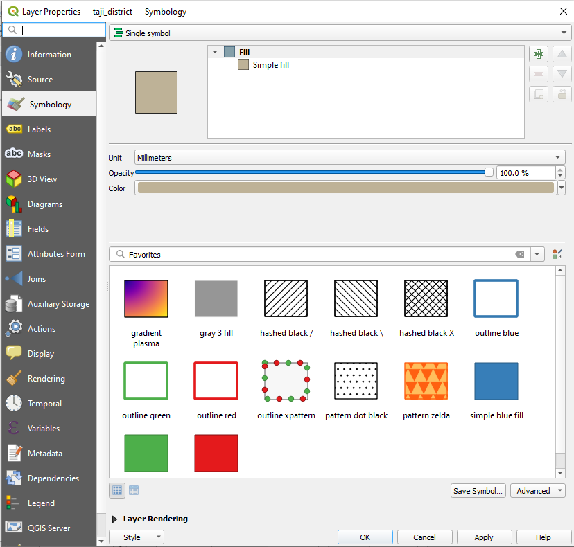

.. _simple-style:

Simple style
============
The simple style is simillar to `QGIS <https://qgis.org/en/site/>`_ single symbol style.

The simple style is available for all point, line and polygon datasets. Below is the example of generating the simple style for polygon dataset,

.. code:: python

    # Import and initialized package
    from pysld.style import StyleSld
    sld = StyleSld(style_name='polygonStyle', geom_type='polygon', fill_color='#ffffff', stroke_color='#333333')
    
    # Generate the simple style 
    sld.generate_simple_style()

The above code will generate the following sld file,

.. code:: xml

    <StyledLayerDescriptor version="1.0.0" xsi:schemaLocation="http://www.opengis.net/sld StyledLayerDescriptor.xsd" xmlns="http://www.opengis.net/sld" xmlns:ogc="http://www.opengis.net/ogc" xmlns:xlink="http://www.w3.org/1999/xlink" xmlns:xsi="http://www.w3.org/2001/XMLSchema-instance">
        <NamedLayer>
            <Name>style</Name>
            <UserStyle>
            <Title>style</Title>
            <FeatureTypeStyle>
        <Rule>
            <PolygonSymbolizer>
                <Fill>
                    <CssParameter name="fill">#ffffff</CssParameter>
                    <CssParameter name="fill-opacity">1</CssParameter>
                </Fill>
                <Stroke>
                    <CssParameter name="stroke">#333333</CssParameter>
                    <CssParameter name="stroke-width">1</CssParameter>
                </Stroke>
            </PolygonSymbolizer>
        </Rule>
            </FeatureTypeStyle>
            </UserStyle>
        </NamedLayer>
    </StyledLayerDescriptor>

.. _add-feature-label:

Add feature label
^^^^^^^^^^^^^^^^^

If you want to add the label feature, simple add two more parameters to ``StyleSld`` class as below,

.. code:: python

    # Import and initialized package
    from pysld.style import StyleSld
    sld = StyleSld(style_name='polygonStyle', geom_type='polygon', fill_color='#ffffff', stroke_color='#333333', feature_label=True, attribute_name_label='name')
    
    # Generate the simple style 
    sld.generate_simple_style()

The above code will add the additional ``SLD`` as below,

.. code:: sld

    <TextSymbolizer>
        <Label>
            <ogc:PropertyName>name</ogc:PropertyName>
        </Label>
        
            <CssParameter name="font-family">Arial</CssParameter>
            <CssParameter name="font-size">12</CssParameter>
            <CssParameter name="font-style">normal</CssParameter>
            <CssParameter name="font-weight">bold</CssParameter>
        
        <Fill>
            <CssParameter name="fill">#990099</CssParameter>
        </Fill>
    </TextSymbolizer>

Here is the list of available values and their description for simple style,

.. _simple-style-options:

Available options for simple style
^^^^^^^^^^^^^^^^^^^^^^^^^^^^^^^^^^

.. list-table:: Options for ``StyleSld`` 
    :widths: 15 15 15 55
    :header-rows: 1

    * - Options
      - DataType
      - Default
      - Description 

    * - style_name
      - string
      - 'style'
      - The name of the style file.

    * - geom_type 
      - string
      - 'polygon'
      - The type of geometry. The available values are ``point``, ``line`` and ``polygon``.

    * - fill_color
      - string, color code 
      - '#ffffff'
      - Fill color for the point or polygon. Not applicable for line.

    * - stroke_color
      - string, color code 
      - '#333333'
      - Stroke color (outline color) for the input ``geom_type``.

    * - stroke_width
      - numeric
      - 1
      - Stroke width (outline width) for the input ``geom_type``.

    * - opacity
      - integer
      - 1
      - Fill opacity for the point or polygon feature. The value must be between 0 and 1. Not applicable for line. 

    * - point_size
      - numeric
      - 6
      - The size of the point feature. The parameter will be ignored for polygon and line feature.

    * - well_known_name
      - string 
      - 'circle'
      - The name of the shape. Available options are, ``square``, ``circle``, ``triangle``, ``star``, ``cross`` and ``x`` . The parameter will be ignored for polygon and line feature.

    * - point_rotation
      - integer
      - 0
      - Rotation of the point in degree. The value must be between 0-360. The parameter will be ignored for polygon and line feature.

    * - stroke_linecap
      - string 
      - 'round'
      - Determines how lines are rendered at their ends. Possible values are butt (sharp square edge), round (rounded edge), and square (slightly elongated square edge). The parameter will be ignored for point and polygon feature.

    * - stroke_dasharray
      - string
      - None
      - Encodes a dash pattern as a series of numbers separated by spaces. Odd-indexed numbers (first, third, etc) determine the length in pxiels to draw the line, and even-indexed numbers (second, fourth, etc) determine the length in pixels to blank out the line. Default is an unbroken line. The parameter will be ignored for polygon and line feature.

    * - perpendicular_offset
      - integer 
      - None
      - Perpendicular offset for the line. The parameter will be ignored for point and polygon feature.

    * - feature_label
      - boolean
      - False
      - It determines whether to add the feature label or not. If feature_label is true, then you need to pass the ``attribute_name_label`` parameter to label the feature. 

    * - attribute_name_label
      - string 
      - None
      - The name of the attribute, which you want to label.

    * - font_family
      - string
      - 'Aerial'
      - Font family name for the label. eg. 'Aerial', 'Times new roman' etc.

    * - font_color
      - string, color code 
      - '#333333'
      - The Font color for the label.

    * - font_size
      - integer
      - 14
      - Font size for the label. 

    * - font_weight
      - string
      - 'normal'
      - Font weight for the label. Available values are, ``bold`` and ``normal``.

    * - font_style
      - string
      - 'normal'
      - Font style for the label. Available values are, ``normal``, ``italic`` and ``oblique``.

    * - halo_color
      - string, color code 
      - '#ffffff'
      - The colored background around the label text, which improves readability in low contrast situations. 

    * - halo_radius
      - numeric
      - 1
      - The halo radius, in pixels. 

  